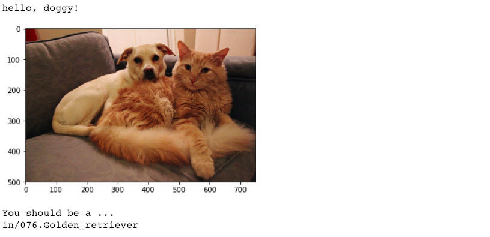
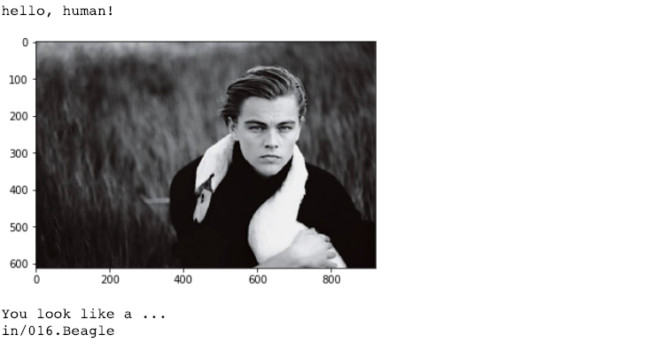
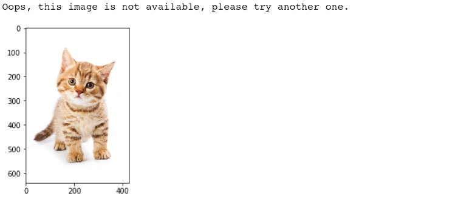

## Project: Dog Breed Recognition

### Overview

This Convolutional Neural Networks (CNN) model accepts user-supplied images as input:

- If a dog is detected in the input image, it provides an estimate of the dog's breed.
- If a human is detected, it will provide an estimate of the dog breed that is most resembling.

→ Project: [Dog-breed-recognition](dog_app.html)

###  Summary

- **Detectors**
  - Human faces: OpenCV's implementation of Haar feature-based cascade classifiers
  - Dog images: ResNet-50

- **Test Accuracy**
  - CNN without transfer learning: 3.2297%
  - Transfer learning with VGG-16 model: 41.7464%
  - Transfer learning with ResNet-50 model: 80.0239%

- **Predictions**

  - **Dogs**
  - 
  - **Human**


  - **Others**


### Project Instructions

#### Datasets

- Download the [dog dataset](https://s3-us-west-1.amazonaws.com/udacity-aind/dog-project/dogImages.zip). Unzip the folder and place it in the repo, at location `path/to/dog-project/dogImages`.
- Download the  [human dataset](https://s3-us-west-1.amazonaws.com/udacity-aind/dog-project/lfw.zip). Unzip the folder and place it in the repo, at location `path/to/dog-project/lfw`. 
- Donwload the [VGG-16 bottleneck features](https://s3-us-west-1.amazonaws.com/udacity-aind/dog-project/DogVGG16Data.npz) for the dog dataset. Place it at location `path/to/dog-project/bottleneck_features`.


#### Install

- This project requires **Python, TensorFlow, Keras** and the following libraries and tools installed:

  - [NumPy](http://www.numpy.org/)
  - [Pandas](http://pandas.pydata.org/)
  - [matplotlib](http://matplotlib.org/)
  - [scikit-learn](http://scikit-learn.org/stable/)
  - [OpenCV](https://opencv.org/)
  - [Jupyter Notebook](http://ipython.org/notebook.html)

- Clone the repository and navigate to the project folder.

  ```
  git clone https://github.com/zmr227/Deep-Learning-Nanodegree.git
  cd 1.\ Dog-Breed-Recognition
  ```

- Switch [Keras backend](https://keras.io/backend/) to TensorFlow.

  - **Linux** or **Mac**

  ```
  KERAS_BACKEND=tensorflow python -c "from keras import backend"
  ```

  - **Windows**

  ```
   set KERAS_BACKEND=tensorflow
   python -c "from keras import backend"
  ```


#### Run

Run the following command in terminal or command window to open the project file.

```
jupyter notebook dog_app.ipynb
```


