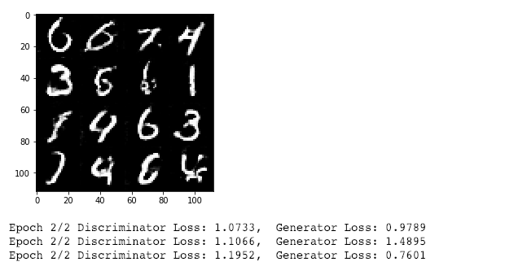
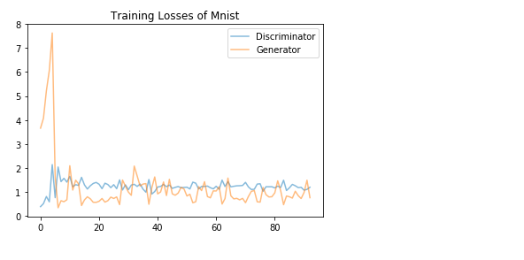
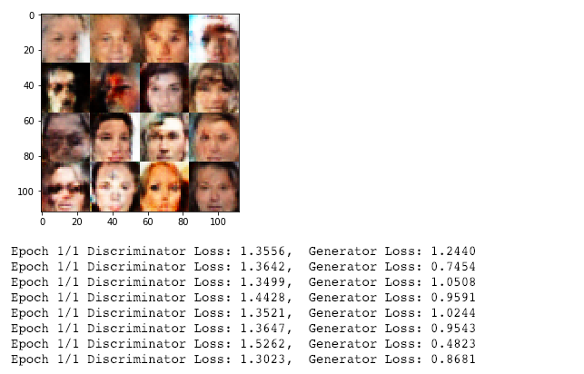
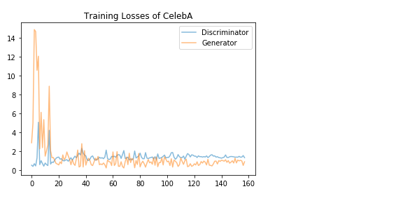

# Project: Face Generation

## Overview

This project uses generative adversarial networks (**GANs**) to generate new images of faces.

- Build Generator neural network to generate new face images and Discriminator to discriminate on images. 
- Activation function: **Leaky ReLU**.
- Test the neural network on MNIST before CelebA since the celebA dataset is more complex. 

##  Summary

- **Source file**:  [Face-Generation.ipynb](dlnd_face_generation.ipynb)

- **Results**

  - **MNIST** dataset:  Discriminator Loss: 1.1952,  Generator Loss: 0.7601

  

  

  - **CelebA** dataset:  Discriminator Loss: 1.3023,  Generator Loss: 0.8681

  

  

## Project Instructions

### Datasets

- Testing GANs on: [MNIST dataset](http://yann.lecun.com/exdb/mnist/). 
- Generate human faces:  [CelebA dataset](http://mmlab.ie.cuhk.edu.hk/projects/CelebA.html). 

### Install

- This project requires **Python** and the following libraries and tools installed:

  - [NumPy](http://www.numpy.org/)
  - [matplotlib](http://matplotlib.org/)
  - [scikit-learn](http://scikit-learn.org/stable/)
  - [TensorFlow  (1.0 or newer version) ](https://www.tensorflow.org/install/)
  - [Jupyter Notebook](http://ipython.org/notebook.html)

- Clone the repository and navigate to the project folder.

  ```
  git clone https://github.com/zmr227/Deep-Learning-Nanodegree.git
  cd 2.\ Face-Generation
  ```

- It would be better to have access to a GPU when training this model with CelebA dataset.


### Run

Run the following command in terminal or command window to execute the project file.

```
jupyter notebook dlnd_face_generation.ipynb
```

