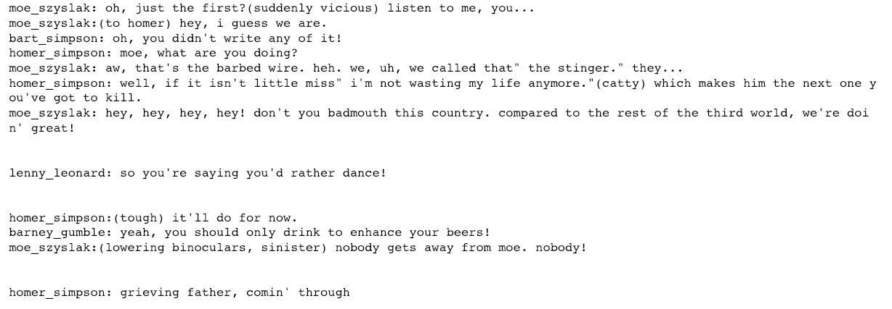

# Project: TV Script Generation

## Overview

This project generates TV Scripts using **LSTM** **network** (RNN composed of Long Short-Term Memory units):

- Using scripts of the [Simpsons dataset](https://www.kaggle.com/wcukierski/the-simpsons-by-the-data) in Moe's Tavern from 27 seasons as training data.
- This Neural Network will generate a new TV script with punctuation for a scene in [Moe's Tavern](https://simpsonswiki.com/wiki/Moe's_Tavern).

## Summary

- **Source File**:  [TV-Script-Generation](dlnd_tv_script_generation.ipynb)

- **Results**:

  

## Project Instructions

### Dataset

-  [Simpsons dataset](https://www.kaggle.com/wcukierski/the-simpsons-by-the-data). Unzip the folder and place it at location `~/data/simpsons`.

### Install

- This project requires **Python** and the following libraries and tools installed:

  - [NumPy](http://www.numpy.org/)
  - [String](https://docs.python.org/3.1/library/string.html)
  - [scikit-learn](http://scikit-learn.org/stable/)
  - [Jupyter Notebook](http://ipython.org/notebook.html)
  - [TensorFlow (version 1.3 or newer)](https://www.tensorflow.org/install/)

- Clone the repository and navigate to the project folder.

  ```
  git clone https://github.com/zmr227/Deep-Learning-Nanodegree.git
  ```

  ```
  cd 3.\ TV-Script-Generation
  ```

- It would be better to have access to a GPU when training this model.

### Run

Run the following command in terminal or command window to execute the project file.

```
jupyter notebook dlnd_tv_script_generation.ipynb
```

