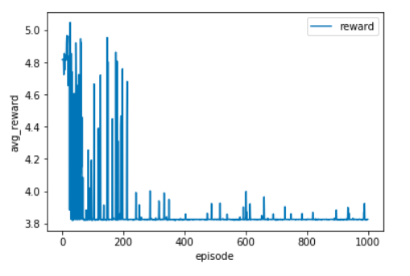

# Project: Train a Quadcopter How to Fly

## Overview

This project performs **Deep Reinforcement Learning** to teach a quadcopter to **takeoff** and reach a target height.

##  Summary

- **Source file**:  [Quadcopter-Project.ipynb](Quadcopter_Project.ipynb)
- **Content**:
  - **Agent**: Built a deep deterministic policy gradients (**DDPG**) model in [agent.py](agents/agent.py)
  - **Task**: Set up the task environment for take off and defined **reward function** in [task.py](task,py)
  - *Quadcopter Simulator*: [physics-sim.py](physics_sim.py)
- **Episode Rewards Plot**:



## Project Instructions

### Install

- This project requires **Python** and the following libraries and tools installed:

  - [NumPy](http://www.numpy.org/)
  - [Pandas](http://pandas.pydata.org/)
  - [matplotlib](http://matplotlib.org/)
  - [TensorFlow ](https://www.tensorflow.org/install/)
  - [Jupyter Notebook](http://ipython.org/notebook.html)

- Clone the repository and navigate to the project folder.

  ```
  git clone https://github.com/zmr227/Deep-Learning-Nanodegree.git
  cd 4.\ Quadcopter-Project
  ```

- It would be better to have access to a GPU when training this model with CelebA dataset.


### Run

Run the following command in terminal or command window to execute the project file.

```
jupyter notebook Quadcopter_Project.ipynb
```

