# Deep Learning

## Chapter 1.  Introduction to Deep Learning

### 1.1 Program Structure:

- **Neural Networks:**   Learn how to build and train a simple neural network from scratch using python

【Build your First Neural Network -- predict bike rental 】 

- **Convolutional Networks:**  Detect and identify objects in images. 

【Object Recognition -- Dog Breed Classifier】 

- **Recurrent Neural Networks ( RNNs ):**  Particularly well suited to data that forms sequences like text, music, and time series data.

【implement [Word2Vec](https://en.wikipedia.org/wiki/Word2vec) model】【Generate TV scripts】 

- **Generative Adversarial Networks ( GANs ) :**   One of the newest and most exciting deep learning architectures, showing incredible capacity for understanding real-world data and can be used for generating images. 

【 [CycleGAN](https://github.com/junyanz/CycleGAN) project】【Generate Novel Human Faces】 

- **Deep Reinforcement Learning**:  Use deep neural networks to design agents that can learn to take actions in simulated environment and then apply it to complex control tasks like video games and robotics.

【Teaching Quadcopter how to Fly】 


### 1.2  Applying Deep Learning

**Related DL Project Examples**:  Style Transfer；Deep Traffic (Reinforcement Learning)；Flappy Bird 

**Books to read：**

- [Grokking Deep Learning](https://www.manning.com/books/grokking-deep-learning) by Andrew Trask. This provides a very gentle introduction to Deep Learning and covers the intuition more than the theory. （discount code: traskud17）
- [Neural Networks And Deep Learning](http://neuralnetworksanddeeplearning.com/) by Michael Nielsen. This book is more rigorous than Grokking Deep Learning and includes a lot of fun, interactive visualizations to play with. 
- [The Deep Learning Textbook](http://www.deeplearningbook.org/) from Ian Goodfellow, Yoshua Bengio, and Aaron Courville. This online book contains a lot of material and is the most rigorous of the three books suggested. 


### 1.3  Anaconda

#### **Concepts**

- **Virtualenv:**  virtual environment that allows you to separate libraries required by different projects to avoid conflict between diff library version or python version. 

- **Anaconda:** a distribution of libraries and software specifically built for data science. 

- **Conda:** a package and environment manager.  

  

#### **General Commands**

- **Create a new project:** type in `conda create -n project_name python=3` in terminal. 

- **Activate project: ** `source activate project_name`

- **See package installed:**  `conda list`

- **If not sure exact package name:** `conda search *possible_name*`

- **Install numpy, pandas** **and matplotlib**: `conda install numpy pandas matplotlib`  or `conda install pandas matplotlib`  ( numpy is a dependency of pandas )

  --> Conda makes sure to also install any packages that are required by the package you're installing. 

- **install Jupyter Notebook:**  `conda install jupyter notebook`

- **Deactivete project**: `source deactivate`

- **Saving environment:**  `conda env export > environment_name.yaml`

- **Loading environment from an environment file (.yaml)** :`conda env create -f environment.yaml` (project name will be "environment") 

- **Listing all environments:**  `conda env list`

- **Remove environment:**  `conda env remove -n env_name`

  

**e.g.** Create an environment named data installed with Python 3.6, numpy, and pandas: 

--> “conda create -n data python=3.6 numpy pandas"


#### **Practice Advices** 

- Create two env on python2 and python3, then install general use packages for each version of python to avoid conflict.   —> "conda create -n py2 python=2" & "conda create -n py3 python=3”

- To share your code on Github, remember to include a “pip_requirements.txt” file using “pip freeze” (<https://pip.pypa.io/en/stable/reference/pip_freeze/>) 


### **1.4  Jupyter Notebook**

**Jupyter** comes from the combination of Julia, Python, and R.
When saving the notebook, it's written to the server as a JSON file with a .ipynb file extension.

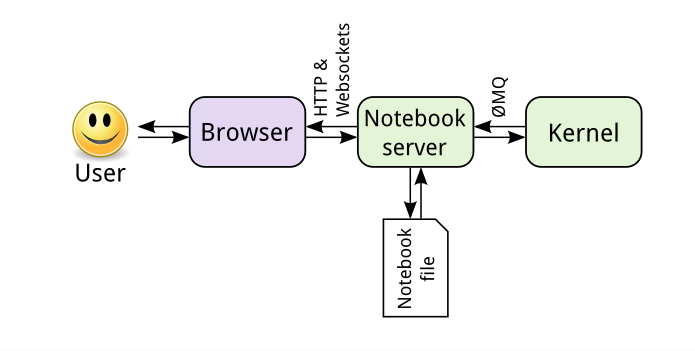

#### **Benefits**

* A great part of this architecture is that code in any language can be sent between the notebook and kernel since they are separate. (e.g. code written in R will be sent to the R kernel [list of available kernels](https://github.com/jupyter/jupyter/wiki/Jupyter-kernels))
* Another benefit is that the server can be run anywhere and accessed via the internet. (set up a server on a remote machine or cloud instance)


#### **Commands**

* **Install:**  `pip install jupyter notebook`  or `conda install jupyter notebook`
* **Launch notebook server:**  Enter `jupyter notebook` in terminal (As long as the server is still running, you can always come back to it by going to http://localhost:8888 in your browser. If you start another server, try 8889)
* **Manage notebook environment:** "conda install nb_conda”
* **Shutdown:** click “Shutdown” in notebook or press “control + C” twice in terminal.


#### **Markdown Cells**

- **Headers:**  using “#”(hash/pound/octothorpe sign)  # Header 1;   ## Header 2;   ### Header 3 
- **Links:**  enclosing text in square brackets and the URL in parentheses.  [Udacity's home page] or ([udacity.com](http://udacity.com)) 
- **Emphasis:**  * or _ for Italics;  ** or __ for Bold. ( _gelato_ or *gelato* ==> *gelato ;*  **aardvark** or __aardvark__ ==> aardvark ) 
- **Math Expression:**  To start math mode, wrap the **LaTeX** in dollar signs $y = mx + b$ for inline math. For a math block, use double dollar signs to enclose. ( About LaTeX: [please read this primer](http://data-blog.udacity.com/posts/2016/10/latex-primer/) ) 
- **Code:**  'inline code’ or create a ''' code block '''. 

  A cheatsheet for Markdown:  <https://github.com/adam-p/markdown-here/wiki/Markdown-Cheatsheet> 


#### **Magic Keywords** 

* **Magic Keywords:** preceded with one or two percent signs (%, %%) for line and cell magics, respectively. 

- **%matplotlib:**  a plotting library for Python and NumPy. 
- **%timeit:**  time how long it takes for a function ( %timeit ) or the whole cell ( %%timeit ) to run.

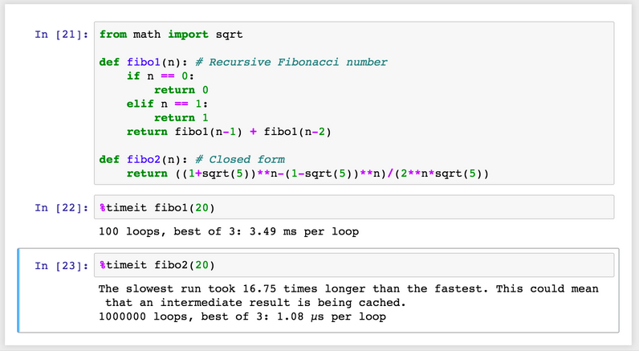

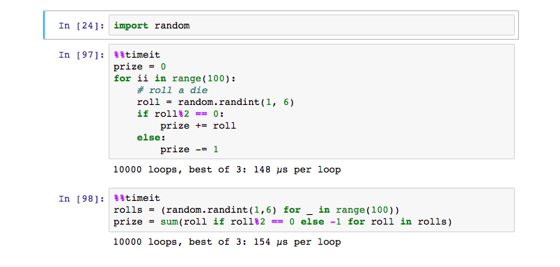

---> **List of all available magic commands:**  [Magic Command List](http://ipython.readthedocs.io/en/stable/interactive/magics.html) 


#### **Embedding Visualizations**

- **%matplotlib:** Set up matplotlib for interactive use in the notebook. By default figures will render in a new window. 
- **%matplotlib inline:** Render figures directly in the notebook.  ( To render higher resolution images —> Use "%config InlineBackend.figure_format = ‘retina’" after "%matplotlib inline” ) 


#### **Debugging**

- With Python kernel, turn on interactive debugger using magic command `%pdb` . To turn it off, enter `q` .
- Read more about `pdb` in [this documentation](https://docs.python.org/3/library/pdb.html)


#### Converting Format

- Notebooks are big [JSON](http://www.json.org/) files with the extension `.ipynb` .
- **Convert to an HTML file:** `jupyter nbconvert --to html notebook.ipynb` in terminal.
- Learn more about converting: [nbconvert documentation](https://nbconvert.readthedocs.io/en/latest/usage.html)


#### Slideshow with Notebook

- In the menu bar, click `View > Cell Toolbar > Slideshow` to bring up the slide cell menu on each cell.

- **Slides**: full slides move through left to right. 

- **Sub-slides**: show up in the slideshow by pressing up or down. 

- **Fragments**: hidden at first, then appear with a button press. 

- **Skip:** skip cells in the slideshow. 

- **Notes**: leaves the cell as speaker notes.

  

- **Running Slideshow:**  `jupyter nbconvert notebook.ipynb --to slides` 

  ​					(need to serve it with an HTTP server to actually see the presentation)

-  **To convert and open it in browser :** `jupyter nbconvert notebook.ipynb --to slides --post serve`

  [An example of a slideshow introducing pandas](http://nbviewer.jupyter.org/format/slides/github/jorisvandenbossche/2015-PyDataParis/blob/master/pandas_introduction.ipynb#/). 


### 1.5 Matrix Math and NumPy Refresher

#### Data Dimension

- **Scalars**:  have 0 dimension
- **Vectors**:  row vectors & column vectors; have 1 dimensions **(length)**
- **Matrices**:  2 dimensional grid of values. ( n rows × m columns == n by m matrix; referred by indices )
- **Tensors**:  can refer to any n-dimensional collection of values. (e.g. scalar --> zero-dimensional tensor)

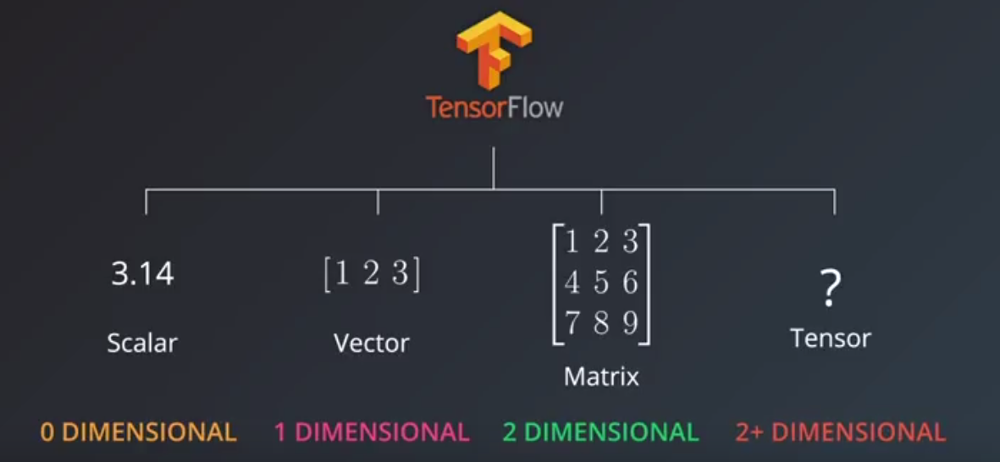


#### NumPy Introduction

- **NumPy**:  a library that provides fast alternatives to math operations in Python, designed to work efficiently with groups of numbers. (like matrices)  --> [documentation](https://docs.scipy.org/doc/numpy/reference/).

- **Import** **Command**:  `import numpy as np`

- **Data Type:** "nparray" object can store any number of dimensions and support fast math operations, thus it can represent any of the data types covered before: scalars, vectors, matrices, or tensors. 

- **Shape**:  Returns a tuple of array dimensions. ( If we define`s = np.array(5)`  then execute `s.shape`, it will return `( )` as 5 is a scalar and has 0 dimension. )

- **Reshape**:  Changing the shape of data without changing its value. --> [documentation](https://docs.scipy.org/doc/numpy/reference/generated/numpy.reshape.html) 

  --> e.g. `v = np.array([1,2,3,4])` ; use  `x = v.reshape(4,1)` or `x = v[:, None]` to add dimension;  (x will be a 4*1 matrix version of vector v )


- **Scalar**: Numpy allows specify size and sign of your data, so instead of "int" in Python, it has types like  `uint8`, `int8`, `uint16`, `int16`, and so on. ( **Every item in an array must have the same type**. )

- **Vector**:  Pass a Python list to the array function`v = np.array([1,2,3])`to create a vector and access elements by their indices. ( `v.shape` == `(3,)` ;  `v[1] == 2`)

- **Matrices**: pass a list of list to NumPy's array function. `m = np.array([[1,2,3], [4,5,6], [7,8,9]])`   ( `m.shape == (3,3)` ;  `m[1][2] == 6`)

- **Tensors**: To create a 3x3x2x1 tensor,` t = np.array([[[[1],[2]],[[3],[4]],[[5],[6]]],[[[7],[8]],\    [[9],[10]],[[11],[12]]],[[[13],[14]],[[15],[16]],[[17],[17]]]])`  (`t.shape == (3,3,2,1) `)

  

#### Matrix Operations
- **Element-wise**:  simply apply calculation on each pair of corresponding elements in the matrices. 

- **Add **(Element-wise): `values = [1,2,3,4,5] ` , `values = np.array(values) + 5`  or `values += 5` if values is already a nbarray (the new values == ndarray [6,7,8,9,10] )

- **Multiply**  (Element-wise)  : `np.multiply(array, 5)`; `array *= 5` or `np.multiply(m, n) `;  `m * n`

- **Set Zero**:  `m *= 0` before you want to set all elements of matrix m to zero.

  

- **Matrix Product**：`np.matmul(A, B)` ( Order Matters!  A · B ≠ B · A ) 

  --> `dot` function in NumPy can do the same when dealing with 2-dimensional matrices. [matmul](https://docs.scipy.org/doc/numpy/reference/generated/numpy.matmul.html#numpy.matmul) ,[dot.](https://docs.scipy.org/doc/numpy/reference/generated/numpy.dot.html) 

  !Matrix-Product-Example](images/matrix-multi.png)

  ##### Important Reminders About Matrix Multiplication/Product 

  - The number of columns in the left matrix must equal the number of rows in the right matrix. 

  - The answer matrix always has the same number of rows as the left matrix and the same number of columns as the right matrix. 

  - Order matters. Multiplying A•B is not the same as multiplying B•A. 

  - Data in the left matrix should be arranged as rows., while data in the right matrix should be arranged as columns. 

    

- **Matrix Transpose**: a matrix with the same value as the original, but its rows and columns switched.

  Use `m.T` or `m.transpose()` to transpose m.

  --> **Warning**: Be careful when modifying objects because NumPy does this without actually moving any data in memory - it simply changes the way it indexes the original matrix.

  --> Only use transpose in a matrix multiplication if data in both original matrices is arranged as rows.

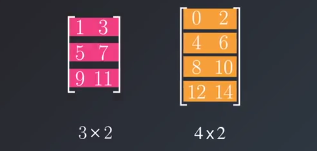


## Chapter 2.  Neural Networks

### 2.1  Introduction to Neural Networks

#### Classification Problems

- **2-dimensions**:  separate with a line (Linear Boundary)

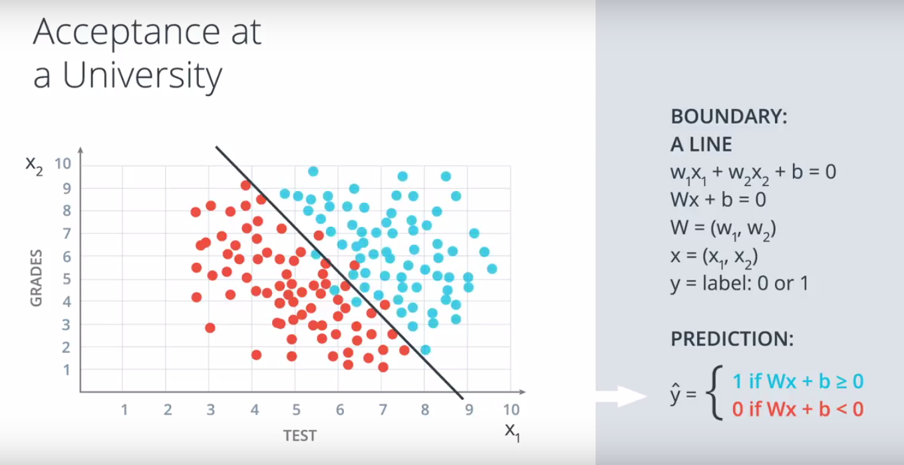


- **Higher Dimensions**  (If it's 3 dimensional, separate with a plane)
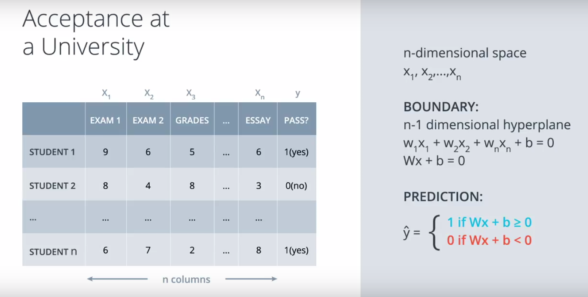


#### Perceptron

- Why it's called Neural Network: perceptrons look like the neurals in the brain.

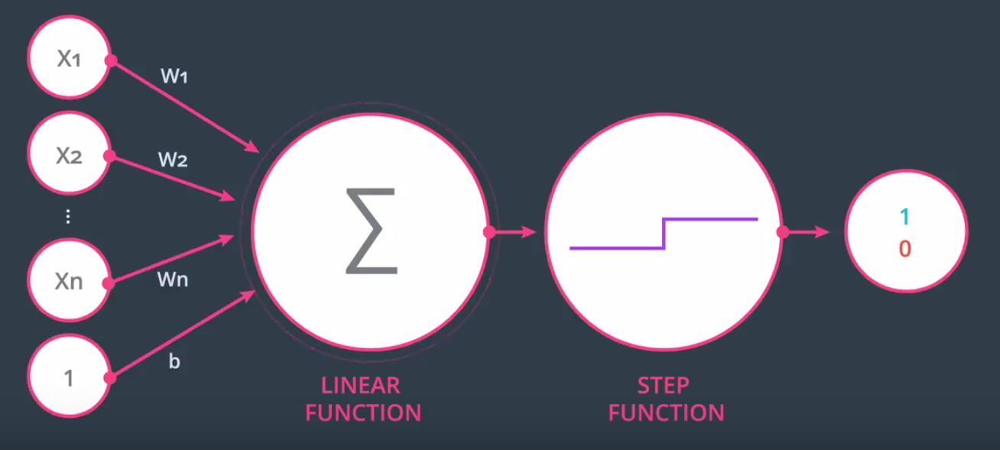 

- AND perceptron, OR perceptron, NOT perceptron, XOR perceptron ( XOR returns true only when one of the inputs is true and the other is false; NAND refers to NOT + AND ). 

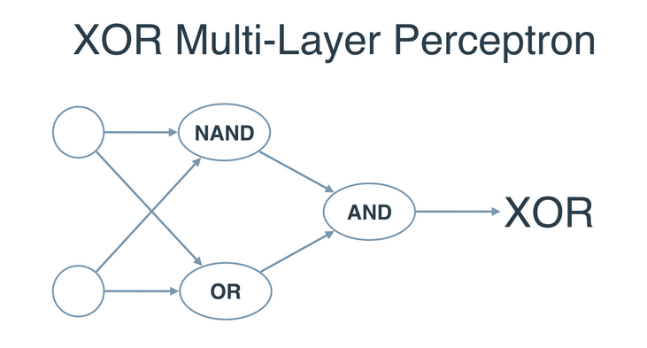

#### Perceptron Trick

- **Learning Rate**:  To come closer to the misclassified point, we subtract each parameter with the coordinates of the point (4, 5) and bias (1) times learning rate 0.1 so the line won't move so drastically.

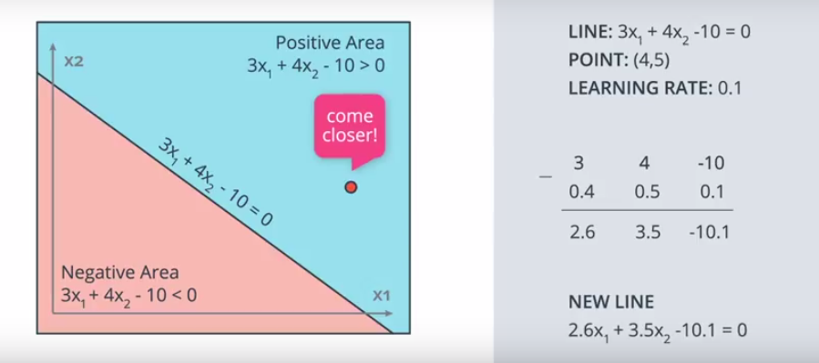


- **Psedo-code & Python for Perceptron Algorithm**:

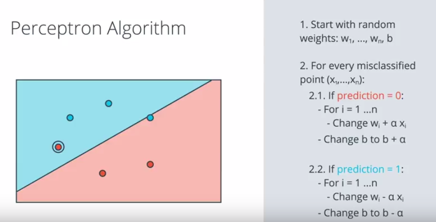 


```python
import numpy as np
np.random.seed(42)

def stepFunction(t):
    if t >= 0:
        return 1
    return 0
    
def prediction(X, W, b):
    return stepFunction((np.matmul(X,W)+b)[0])

# The function should receive as inputs the data X, the labels y,
# the weights W (as an array), and the bias b,
# update the weights and bias W, b, according to the perceptron algorithm,
# and return W and b.

def perceptronStep(X, y, W, b, learn_rate = 0.01)
    for i in range(len(X)):
        y_pred = prediction(X[i], W, b)
        if y[i] - y_pred == 1:
            W[0] += X[i][0] * learn_rate
            W[1] += X[i][1] * learn_rate
            b += learn_rate
        if y[i] - y_pred == -1:
            W[0] -= X[i][0] * learn_rate
            W[1] -= X[i][1] * learn_rate
            b -= learn_rate
    return W, b
    
# This function runs the perceptron algorithm repeatedly on the dataset,
# and returns a few of the boundary lines obtained in the iterations,
# for plotting purposes.
# Feel free to play with the learning rate and the num_epochs,
# and see your results plotted below.
def trainPerceptronAlgorithm(X, y, learn_rate = 0.01, num_epochs = 25):
    x_min, x_max = min(X.T[0]), max(X.T[0])
    y_min, y_max = min(X.T[1]), max(X.T[1])
    W = np.array(np.random.rand(2,1))
    b = np.random.rand(1)[0] + x_max
    # These are the solution lines that get plotted below.
    boundary_lines = []
    for i in range(num_epochs):
        # In each epoch, we apply the perceptron step.
        W, b = perceptronStep(X, y, W, b, learn_rate)
        boundary_lines.append((-W[0]/W[1], -b/W[1]))
    return boundary_lines
```


#### Error Function

- **Error function**: tells the model how far it is from the ideal solution, then the model will continuously take steps to minimize the error.
-  Minimizing error func leads to the best possible solution. (sometimes a local minima is good enough)
- To use **Gradient Descent **, error function should be continuous and differentiable so as to be sensitive to any tiny changes since there's a small learning rate.
- **Log-loss** Error Function: Assign a large penalty to the misclassified points and a small penalty to the correctly classified points. Error = sum of penalties --> move around to decrease error.
- (Penalty --> distance from the boundary for the misclassified points)   


#### Sigmoid vs Softmax

- **Exponential function**: exp( )  will return a positive number for any input, so it's helpful when there's any  negative scores.
- **Sigmoid function**: turns any number into something between 0 and 1.
- Softmax value for N = 2 is the same as the sigmoid function.


```python
import numpy as np
def softMax(L):
	softMax = []
    expL = np.exp(L)
    sumL = np.sum(expL)
    for n in L:
        softMax.append(n/sumL)
    return softMax
```


#### One-Hot Encoding

- **One-Hot**: a group of bits among which the legal combinations of values are only  those with a single high (1) bit and all the others low (0). 

- When the input dataset has non-numerical data, use One-Hot encoding tech to turn them into 0 and 1.

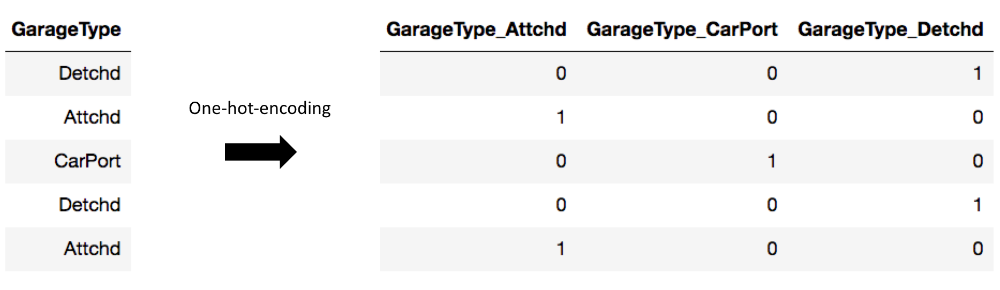


#### Maximum Likelihood

- It's a method to choose the best model, pick the one that gives existing labels the highest probability.

- **Goal**: Maximize the probability that all points are correctly classified. (if independent: p1* p2 * ... * pn)

  --> However, calculating products can be slow when there's large amount of data. --> Sum will be better.  

  --> **log(ab) = log(a) + log(b)** : log function can turn products into sums. 


#### Cross Entropy

- It measures how likely is it that some events happen based on given probabilities. If it's very likely to happen, then cross entropy is small. (take negative of the logarithms and sum them up)
- Good model -- Low Cross Entropy & High Probability;  Bad Model -- High Cross Entropy & Low Possibility
- As an example:

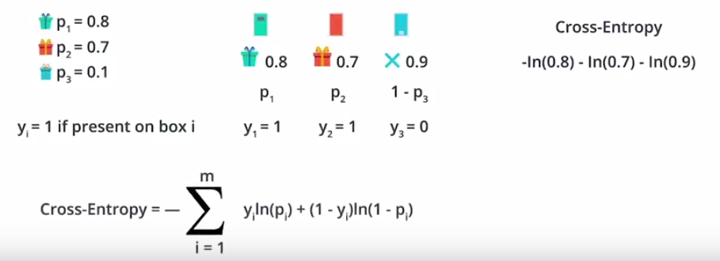

- Calculating Cross Extropy:

```python
import numpy as np

# Write a function that takes as input two lists Y, P,
# and returns the float corresponding to their cross-entropy.
def cross_entropy1(Y, P):
    ce = 0
    for i in range(len(Y)):
        ce += Y[i] * np.log(P[i]) + (1 - Y[i]) * np.log(1 - P[i])
    return -ce

def cross_entropy2(Y, P):
    Y = np.float_(Y)
    P = np.float_(P)
    return -np.sum(Y * np.log(P) + (1 - Y) * np.log(1 - P))
```


- **Multi-Class Cross Entropy**:

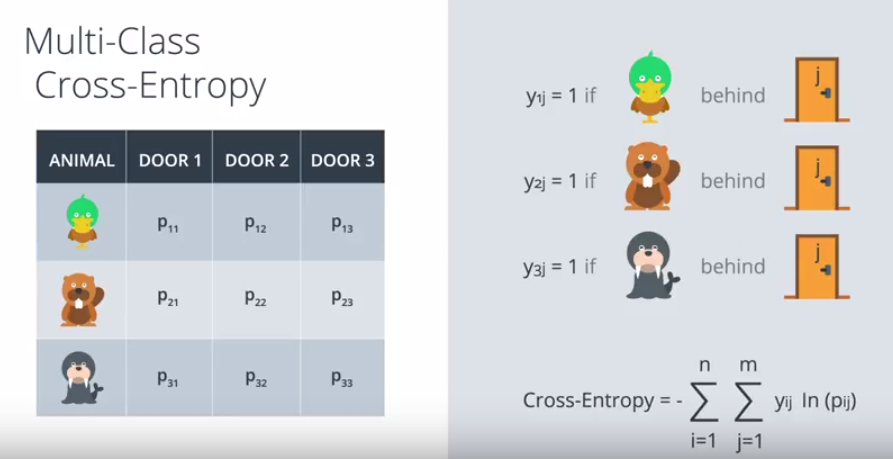


#### Logistic Regression

- Take your data --> Pick a random model --> Calculate error --> Minimize error and obtain a better model

- **Calculate Error Function**: Our Goal is to Minimize the Error Function. (using **Gradient Descent**)

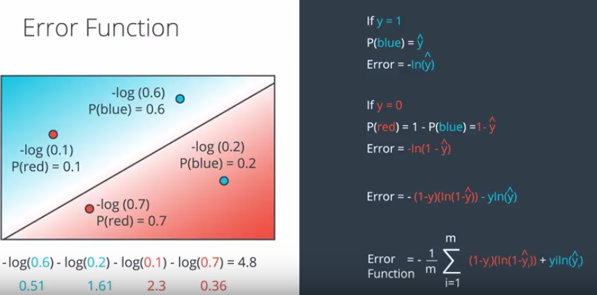

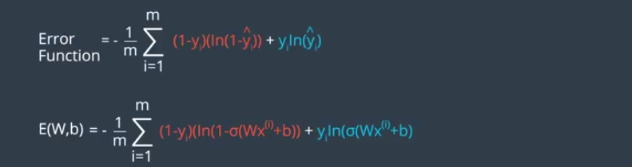

  

  

#### Gradient Descent:  

- Closer/Further the label is to the prediction, Smaller/Larger the gradient. Thus, we tell which direction to move toward by calculating gradient.
- A small gradient means we'll change our coordinates by a little bit, and a large gradient means we'll change our coordinates by a lot.
- **Gradient Descent Step**: subtracting a multiple of the gradient of the error function at every point, then updates the weights and bias.

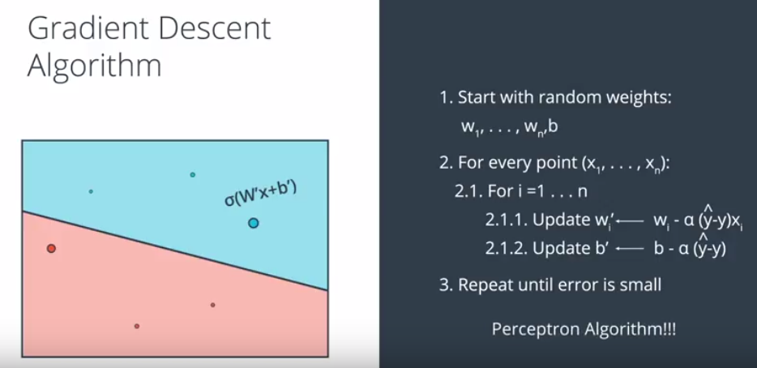

```python
# Implement the following functions

import numpy as np

# Activation (sigmoid) function
def sigmoid(x):
    return 1 / (1 + np.exp(-x))

# Output (prediction) formula
def output_formula(features, weights, bias):
    pred = np.matmul(features, weights) + bias
    return sigmoid(pred)

# Error (log-loss) formula
def error_formula(y, output):
    return -y * np.log(output) - (1 - y) * np.log(1 - output)

# Gradient descent step
def update_weights(x, y, weights, bias, learnrate):
    output = output_formula(x, weights, bias)
    error = y - output
    weights += learnrate * error * x
    bias += learnrate * error
    return weights, bias
```


#### Perceptron vs Gradient Descent

- In perceptron Algorithm, only misclassified points will change weights to get the line closer to it and the correctly classified points will do nothing. 

- While in GD, every point will change the weights, the correct points will ask the line to go further away.

- In Gradient Descent, y_hat can be any number between 0 and 1, but in Perceptron it can only be 0 or 1.

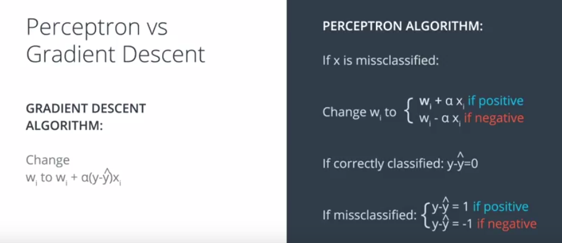


#### Neural Network Architecture

- **Non-Linear Models**: for the data which is not separable with a line, create a non-linear probability function to separate different regions. (combine two linear models --> one non-linear model)

- **Combine Models**:

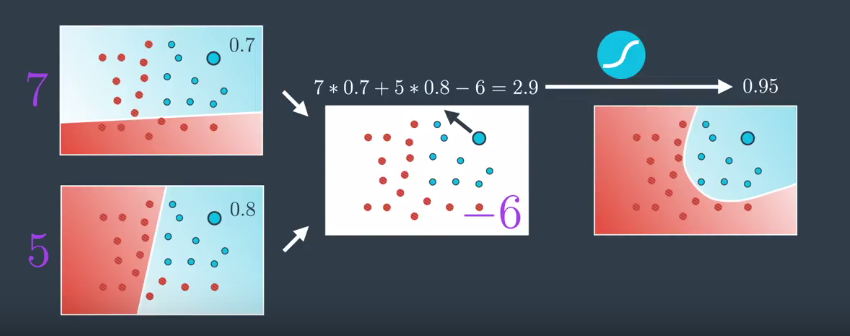

- **Example**: in the graph below, weights on the left represents the equation of previous linear model, weights on the right shows the linear combination of the two models.

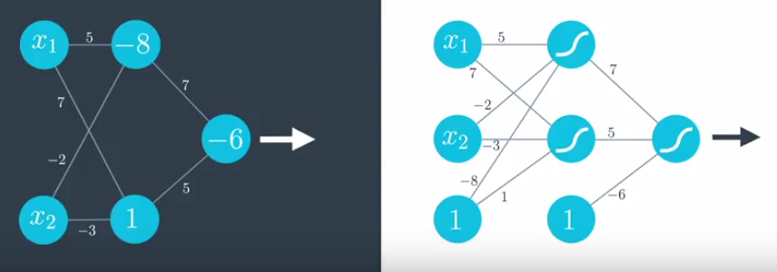

  

- **Neural Network Architecture**: NN takes the input vector and then apply a sequense of linear models and sigmoid functions, then combine them into a highly non-linear map. 

  NN consists of layers. ( Input --> Hidden --> Output ) 

  In general, if there's n nodes in the input layer, we'll consider the model in n-dimensional space.

  - **Input Layers**: contains the inputs.

  - **Hidden Layers**: a set of linear models created from the input layer.

  - **Output Layers**: where the linear model get combined to obtain a non-linear model. (If there's more than 1 outputs --> **Multiclass Classification Model**)

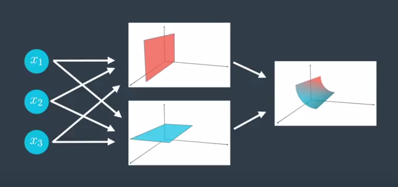

- **Deep Neural Network**: NN that contains more layers. We can do combination multiple times to obtain highly complex models with lots of hidden layers. (deep stack of hidden layers)

  - Linear models combine to create non-linear models, and then these non-linear models combines to create even more non-linear models.
  - NN will split the n-dimensional space with a highly non-linear boundary.

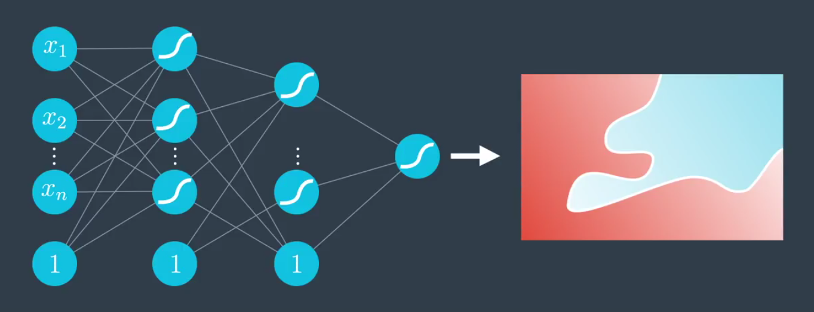

- **Multiclass Classification Model**: add more nodes in the output layer and each one will provide the probability that the image is A, B, C .... Then apply SoftMax function to the scores provided to obtain well-defined probabilities.

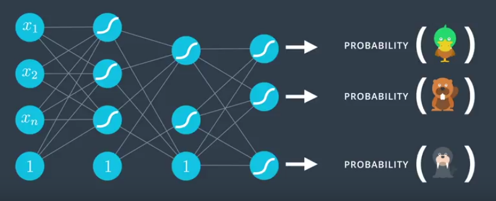

  

#### Feedforward

- Train NN: figure out what parameter should be placed on the edges in order to model the data well.

- **Feedforward** is the process neural networks use to turn the input into an output (y_hat). 

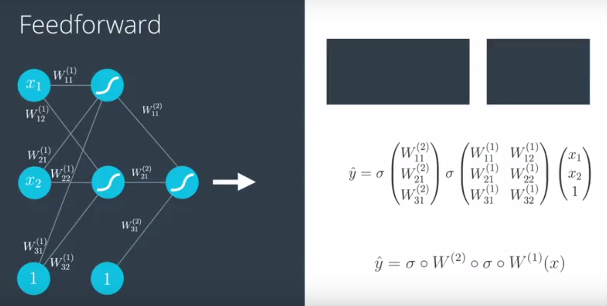

- **Error Function**: gives a measure of how badly a point gets misclassified. ( It will be measuring how far the point is from the line if it's misclassified and error will be very small if it's correctly classified. )


#### Backpropagation

- Error for units is proportional to the error in the output layer times the weight between the units.
- We can flip the network over, use the error as input and keep propagating errors through the layers.

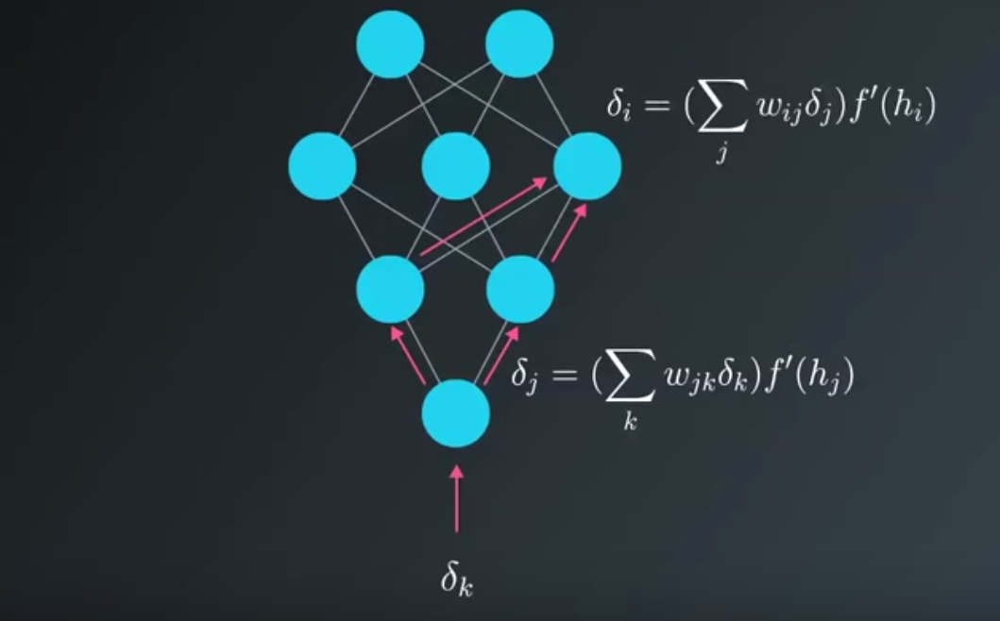

- In a nutshell, backpropagation will consist of:
  - Doing a feedforward operation.

  - Comparing the output of the model with the desired output.

  - Calculating the error.

  - Running the feedforward operation backwards (backpropagation) to spread the error to each of the weights. (increase weights of model and reduce weights of those )

  - Use this to update the weights, and get a better model both in the hidden layer and output layer.

  - Continue until we get a model that is good enough.

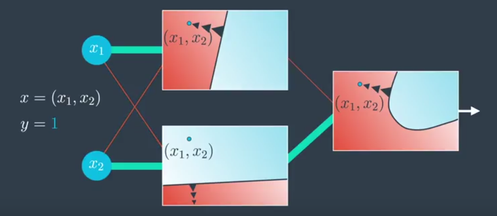

- **Calculating the Gradient**:

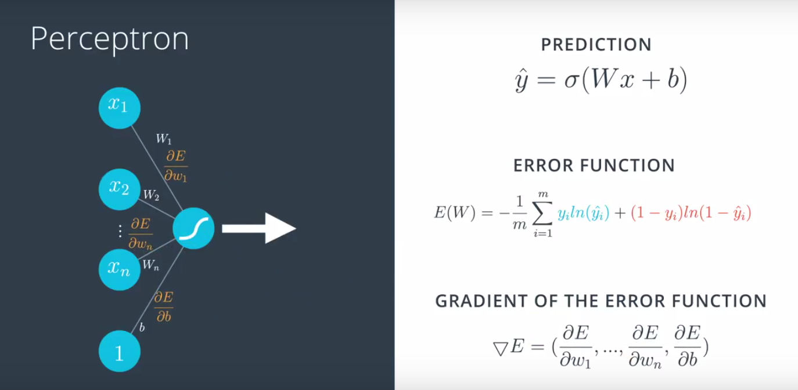

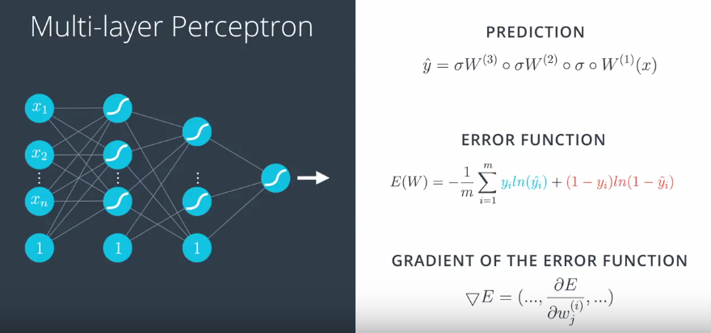

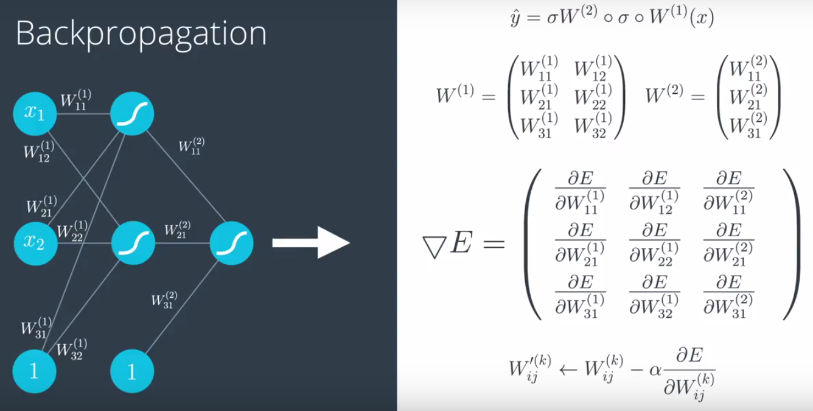


### 2.2  Implementing Gradient Descent

#### Sum of Squared Error (SSE)

- The square ensures the error is always positive and larger errors (outliers) are penalized more than smaller errors. Also, it makes the math nice, always a plus.
- **variable *j***: represents the output units of the network. So the inside sum is saying for each output unit, find the difference between the true value y and the predicted value y_hat, then square the difference and sum up all those squares. 
-  **variable *μ***: the other sum over μ is a sum over all the data points. For each data point, calculate the inner sum of the squared differences for each output unit. Then sum up those squared differences of each data points. That gives us the overall error for all the output predictions for all data points.

- Since the output of a neural network (prediction) depends on the weights, so it can also be written as the second equation, and the 1/2 here is added to help clean the math later:

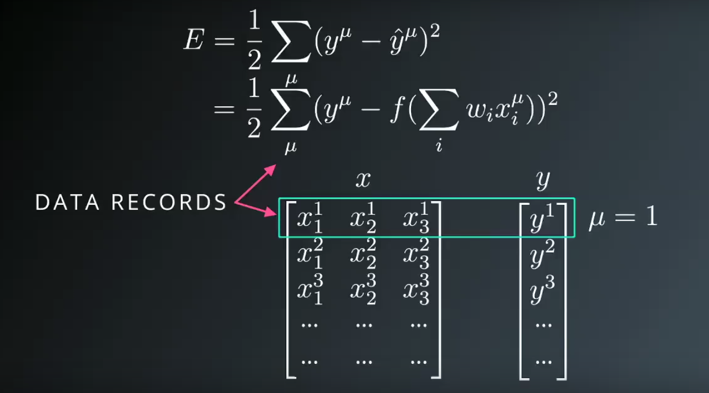


#### Mean Squared Error (MSE)

- When the dataset is large, summing up all the weight steps can lead to really large updates that make the gradient descent diverge.
- To compensate for this, we'll need to use a quite small learning rate or just divide by the number of records (m) in our dataset to take the average.


#### Gradient Descent

- Our goal is to find weights *Wij* that minimize the squared error *E*. --> Gradient Descent. 

- Since the steps taken should be in the direction that minimizes error the most. We can find this direction by calculating *gradient* of the squared error. (**Gradient **is another term for rate of change or slope.)

- **Calculating Gradient**: The gradient is a derivative generalized to functions with more than one variable. We can use calculus to find the gradient at any point in error function, which depends on the input weights. ( A derivative of a function *f(x)* returns the slope of *f(x)* at point x. )

- **Local Minima**: If the weights are initialized with the wrong values, gradient descent could lead the weights into a local minimum where the error is low, but not the lowest. (To avoid this, try [momentum](http://sebastianruder.com/optimizing-gradient-descent/index.html#momentum).)

- **Activation function f(h)** :

    - A func that takes input signal and generates an output signal, but takes the threshold into account.
    -  `h=∑wixi`, If we use sigmoid as `f(h)`, gradient'll be `f'(h) = f(h)*(1-f(h))`

- **Data Clean-up**: one-hot encoding, standardize data (scale the values such that they have mean of zero and a standard deviation of 1) 

  - Standardize will be necessary because the sigmoid function squashes really small and really large inputs. Gradient of really small and large inputs is zero, which means the gradient descent step will go to zero too.

- **Initialize weights**: initialize the weights from a normal distribution centered at 0, n is the number of input units. 

    - This scale keeps the input to the sigmoid low for increasing numbers of input units. 
    - It's also important to initialize them randomly so that they all have different starting values and diverge, breaking symmetry. 

    ```python
    weights = np.random.normal(scale=1/n_features**.5, size=n_features)
    ```

- **Update Weights**:

  - Set the weight step to zero: **Δwi=0**
  - For each record of data: Make a forward pass through the network; calculating the output y_hat; Calculate error term for the output unit; Update the weight step **Δwi=Δwi+δxi**.
  - Update the weights wi=wi+ηΔwi/m. η is the learning rate and m is the number of records. Here we're averaging the weight steps to help reduce any large variations in the training data.
  - Repeat for e epochs.


#### Math for Gradient Descent

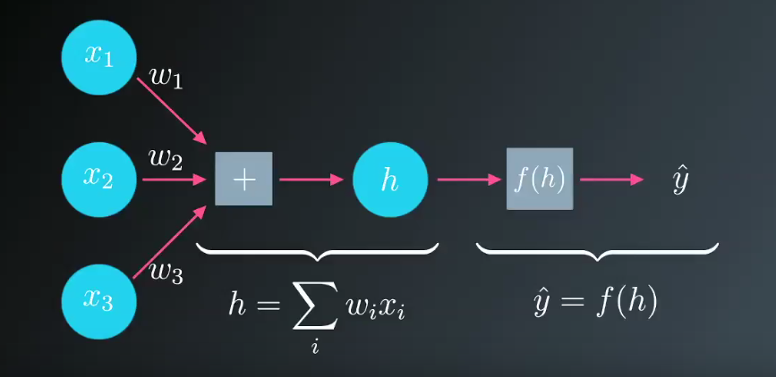

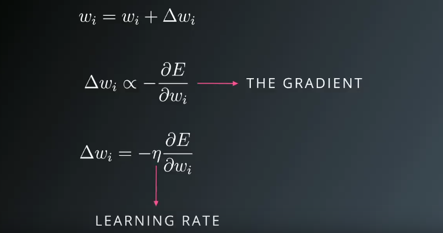

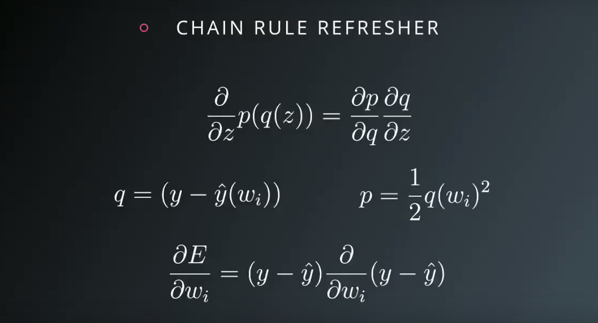

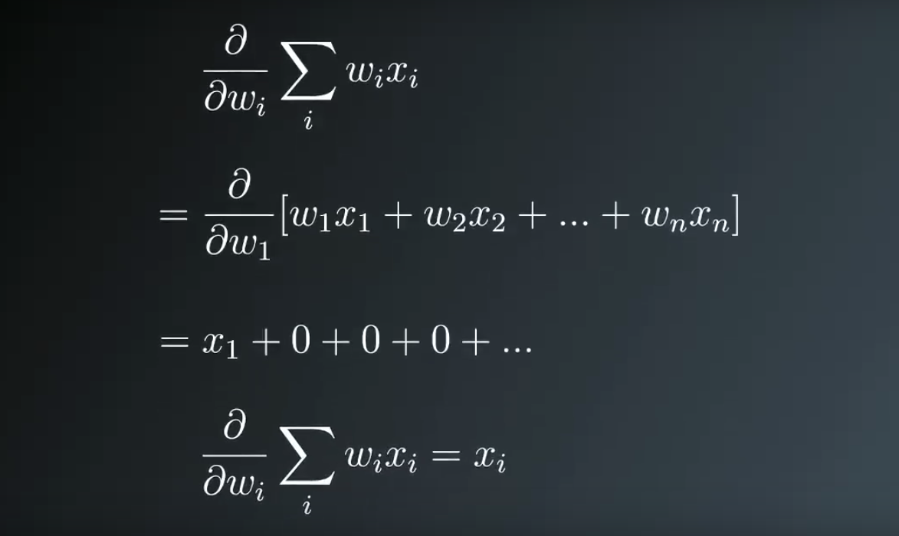

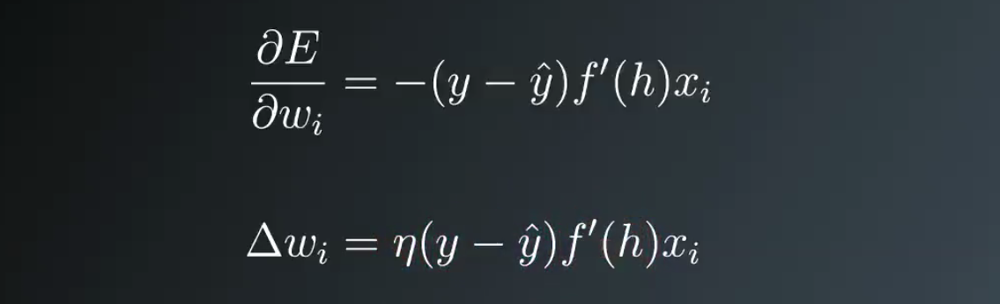

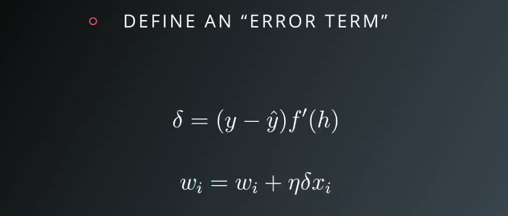

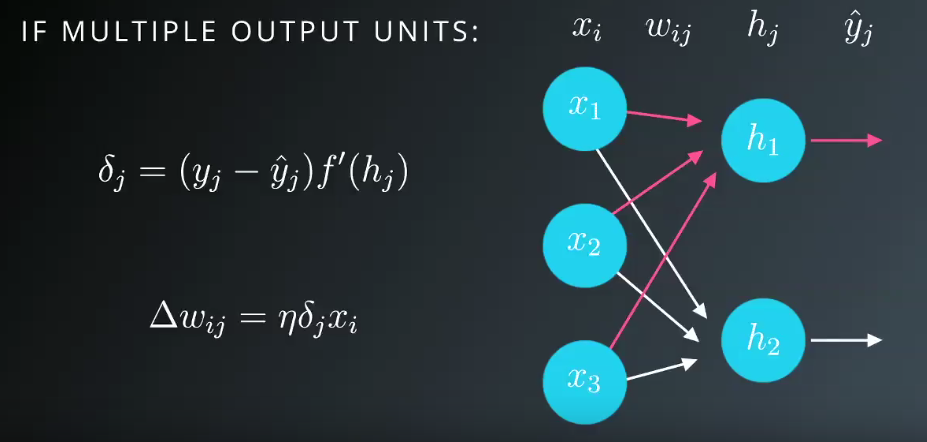


#### Code for Gradient Descent

- Basic Code:

```python
import numpy as np
from data_prep import features, targets, features_test, targets_test

# Defining the sigmoid function for activations
def sigmoid(x):
    return 1/(1+np.exp(-x))

# Use to same seed to make debugging easier
np.random.seed(42)

n_records, n_features = features.shape
last_loss = None

# Initialize weights
weights = np.random.normal(scale=1 / n_features**.5, size=n_features)

# Neural Network hyperparameters
epochs = 1000
learnrate = 0.5

for e in range(epochs):
    del_w = np.zeros(weights.shape)
    for x, y in zip(features.values, targets):
    	# Loop through all records, x is the input, y is the target

        # Activation of the output unit
        #   Notice we multiply the inputs and the weights here 
        #   rather than storing h as a separate variable 
        output = sigmoid(np.dot(x, weights))

        # The error, the target minus the network output
        error = y - output

        # The error term
        #   Notice we calulate f'(h) here instead of defining a separate
        #   sigmoid_prime function. This just makes it faster because we
        #   can re-use the result of the sigmoid function stored in
        #   the output variable
        error_term = error * output * (1 - output)

        # The gradient descent step, the error times the gradient times the inputs
        del_w += error_term * x

    # Update the weights here. The learning rate times the 
    # change in weights, divided by the number of records to average
    weights += learnrate * del_w / n_records
	
    # Printing out the mean square error on the training set
    if e % (epochs / 10) == 0:
        out = sigmoid(np.dot(features, weights))
        loss = np.mean((out - targets) ** 2)
        if last_loss and last_loss < loss:
            print("Train loss: ", loss, "  WARNING - Loss Increasing")
        else:
            print("Train loss: ", loss)
        last_loss = loss
     
    
# Calculate accuracy on test data
tes_out = sigmoid(np.dot(features_test, weights))
predictions = tes_out > 0.5
accuracy = np.mean(predictions == targets_test)
print("Prediction accuracy: {:.3f}".format(accuracy))
```

- **Multilayer Perceptrons**:

```python
import numpy as np

def sigmoid(x):
    """
    Calculate sigmoid
    """
    return 1/(1+np.exp(-x))

# Network size
N_input = 4
N_hidden = 3
N_output = 2

np.random.seed(42)
# Make some fake data
X = np.random.randn(4)

weights_input_to_hidden = np.random.normal(0, scale=0.1, size=(N_input, N_hidden))
weights_hidden_to_output = np.random.normal(0, scale=0.1, size=(N_hidden, N_output))


# TODO: Make a forward pass through the network

hidden_layer_in = np.dot(X, weights_input_to_hidden)
hidden_layer_out = sigmoid(hidden_layer_in)

print('Hidden-layer Output:')
print(hidden_layer_out)

output_layer_in = np.dot(hidden_layer_out, weights_hidden_to_output)
output_layer_out = sigmoid(output_layer_in)

print('Output-layer Output:')
print(output_layer_out)
```


#### Implementing Backpropagation:

General algorithm for updating the weights with backpropagation:

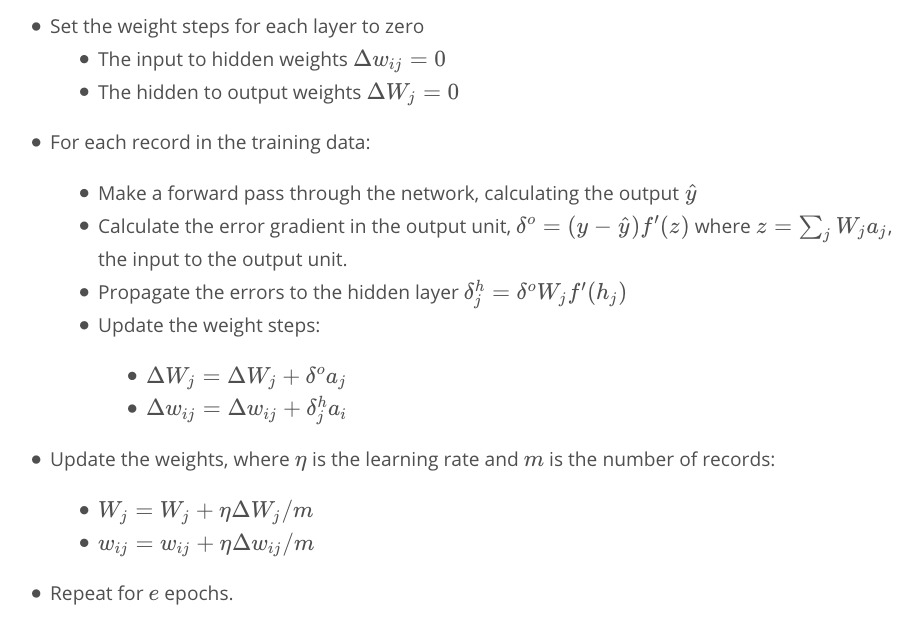

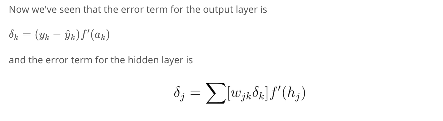

```python
import numpy as np
from data_prep import features, targets, features_test, targets_test

np.random.seed(21)

def sigmoid(x):
    """
    Calculate sigmoid
    """
    return 1 / (1 + np.exp(-x))


# Hyperparameters
n_hidden = 2  # number of hidden units
epochs = 900
learnrate = 0.005

n_records, n_features = features.shape
last_loss = None
# Initialize weights
weights_input_hidden = np.random.normal(scale=1 / n_features ** .5,
                                        size=(n_features, n_hidden))
weights_hidden_output = np.random.normal(scale=1 / n_features ** .5,
                                         size=n_hidden)

for e in range(epochs):
    del_w_input_hidden = np.zeros(weights_input_hidden.shape)
    del_w_hidden_output = np.zeros(weights_hidden_output.shape)
    for x, y in zip(features.values, targets):
        ## Forward pass ##
        # TODO: Calculate the output
        hidden_input = np.dot(x, weights_input_hidden)
        hidden_output = sigmoid(hidden_input)

        output = sigmoid(np.dot(hidden_output,
                                weights_hidden_output))

        ## Backward pass ##
        # TODO: Calculate the network's prediction error
        error = y - output

        # TODO: Calculate error term for the output unit
        output_error_term = error * output * (1 - output)

        ## propagate errors to hidden layer

        # TODO: Calculate the hidden layer's contribution to the error
        hidden_error = np.dot(output_error_term, weights_hidden_output)

        # TODO: Calculate the error term for the hidden layer
        hidden_error_term = hidden_error * hidden_output * (1 - hidden_output)

        # TODO: Update the change in weights
        del_w_hidden_output += output_error_term * hidden_output
        del_w_input_hidden += hidden_error_term * x[:, None]

    # TODO: Update weights
    weights_input_hidden += learnrate * del_w_input_hidden / n_records
    weights_hidden_output += learnrate * del_w_hidden_output / n_records

    # Printing out the mean square error on the training set
    if e % (epochs / 10) == 0:
        hidden_output = sigmoid(np.dot(x, weights_input_hidden))
        out = sigmoid(np.dot(hidden_output,
                             weights_hidden_output))
        loss = np.mean((out - targets) ** 2)

        if last_loss and last_loss < loss:
            print("Train loss: ", loss, "  WARNING - Loss Increasing")
        else:
            print("Train loss: ", loss)
        last_loss = loss

# Calculate accuracy on test data
hidden = sigmoid(np.dot(features_test, weights_input_hidden))
out = sigmoid(np.dot(hidden, weights_hidden_output))
predictions = out > 0.5
accuracy = np.mean(predictions == targets_test)
print("Prediction accuracy: {:.3f}".format(accuracy))

```


#### Making a column vector

- By default NumPy arrays work like row vectors, if we need row vector, use `array.T` for its transpose. - 
- However, for a 1D array, the transpose will still return a row vector. Instead, use `array[:,None]`  or `np.array(features, ndmin=2).T` to create a column vector.


### 2.3 Training Neural Networks

#### Overfitting and Underfitting

- **Overfitting**: 
  - overcomplicated model which is too specific, fail to generalize. 
  - Does well in training set but tend to memorize training data instead of learning its characteristics. 
  - Error due to variance.
- **Underfitting**:
  - model too simple to fit the data.
  - Does not do well in the training set. 
  - Error due to bias.
- **Model Selection**:
  - Choose the simple model that does the job instead of the complex one that does a little better.
  - If there's no "good" model, pick an overly complicated model and apply certain technique to prevent overfitting on it.
- **Tech to prevent Overfitting**: Early stopping, Regularization, Dropout


#### Early Stopping

- Training error is always decreasing as we train the model, it keeps fitting the training data better.
- Testing error is large when underfitting, then it decrease when the model generalize well until it get to the minium point. ( **the Goldilocks spot** ) Once pass this spot, the model overfits and stop generalizing.
- **Model Complexity Graph**: 
  - Do GD until testing error stops decreasing and starts to increase. <u>Stop training at that moment</u>.
  - helps determine the # of epochs we should use. (# of epochs reflects model complexity)


#### Regularization ( L1, L2 )

- Error is smaller if the prediction is closer to the actual label. The bad model provides better prediction:

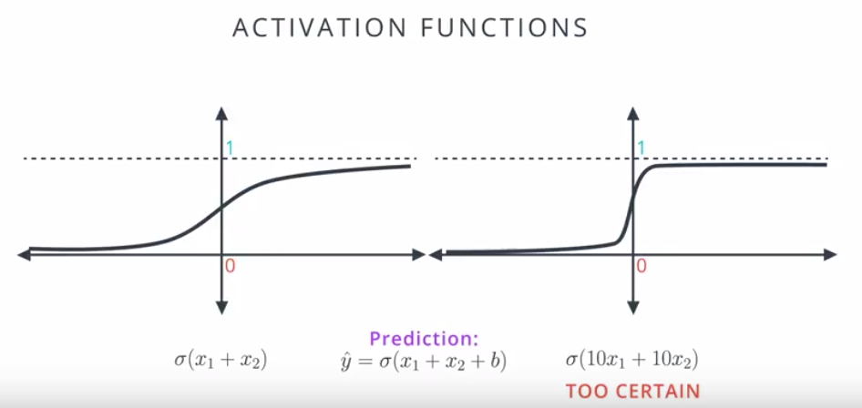

- **Regularization**: punish high coefficients by adding a term to the previous error function, which is big when there's large weights. (constant lambda --> how much to penalize the coefficients)

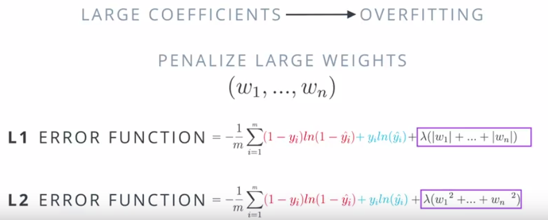

- **L1** **Regularization**: 
  - Small weights tend to go to 0. Reduce weights and end up with a small set. 
  - Usually used to <u>select important features</u> and turn the rest into zeros.
- **L2** **Regularization**: 
  - Try to maintain all weights homogeneously small --> smaller sum of squares --> smaller error func.
  - <u>Normally gives a better results</u> for training models. (Used the most)


#### Dropout

- Sometimes part of the network have very large weights and dominates all training. 
- **Dropout**: As we go through the epochs, randomly turn off some of the nodes (both the feedforward and backpropagation will not use it) and the other nodes will take more part in training. 
- **Dropout Algorithm**: we'll need to provide a parameter of the probability that each node gets dropped in a particular epoch. 


#### Problems of GD 

**1. Got stuck in a local minima**.

- **Solutions**:

  - **Random Restart**: start from several random places and do GD from all of them. It can increase the probability of getting to the global minimum. (or at least a pretty good local minimum)
  - **Momentum**:  The idea is to walk a bit fast with momentum to pass through the local minima to go for a lower minimum. ( Momentum is a constant beta between 0 and 1, those recent steps will matter more and help the model get over the hump. )

  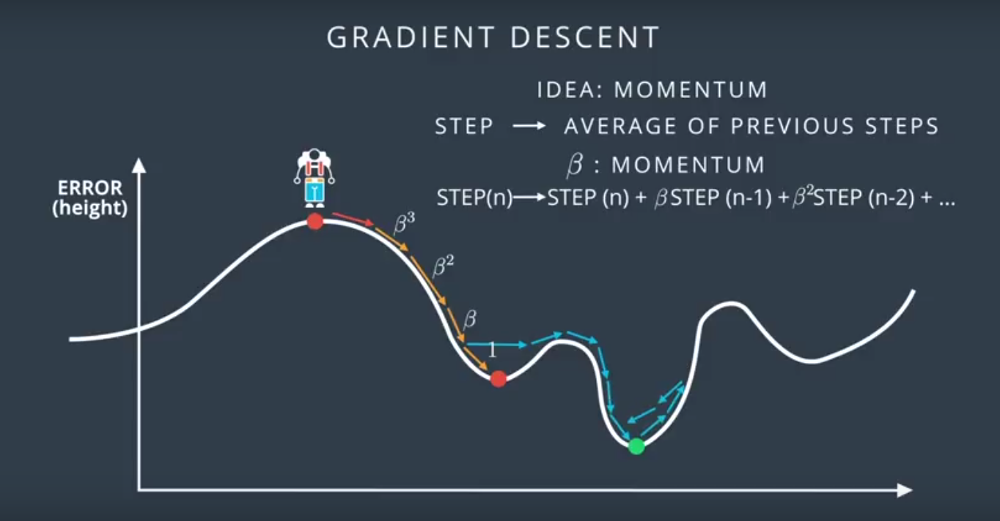

**2.  Vanishing Gradient**:

- **Problem of sigmoid function**: The curve of the sigmoid function gets flat on the sides, so the derivative will be almost zero. This gets worse in multi-layer perceptrons, the product of a bunch of small derivatives will be tiny. 

--> GD will make very tiny changes on weights at each steps and may never get to minimum spot. 

- **Solutions**: 

  - **Change Activation functions**: 
    - **Hyperbolic Tangent**:  It has a larger range than sigmoid, range(-1, 1), thus larger derivative.
    - **Rectified Linear Unit (ReLU)**:  It's widely used since it can imporve the training significantly without sacrifice much accuracy.`relu(x) = x if x ≥ 0 else 0`


#### Stochastic Gradient Descent

- When the dataset is big, GD will require huge matrix computations. 
- Though Stochastic GD will be less accurate, it can save lots of time and memory space.

- **Steps to Implement**:

1. Split the data into several batches 
2. Run the first batch through the network 
3. Calculate error and gradient 
4. Backpropagate to update weights, get better weights and boundary region.
5. Repeat until it finish all batches.


#### Learning Rate Decay

- BIg learning rate --> take huge steps --> fast at the beginning but may miss the minimum.

- Small learning rate --> better chance of reaching local minimum but slow.

- **Rule of thumb**: In general, if the model doesn't work, decrease the learning rate.

- **The best learning rate**: if steep, take long steps; if plain, take small steps. 

  --> learning rate should decrease as the model is getting closer to a solution. 


### 2.6 Sentiment Analysis

- What NN really does is to search for direct or indirect correlation between two datasets. ( learn to take one and predict the other one)